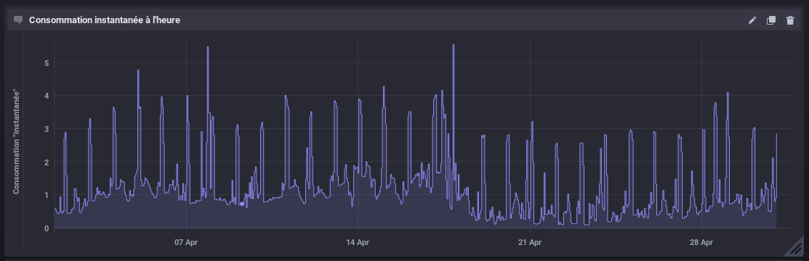

# Linky to InfluxDB

**Linky to InfluxDB** is a Docker image that stores Enedis's Linky daily power consumption to [InfluxDB](https://docs.influxdata.com/influxdb/).

With a [Chronograf](https://www.influxdata.com/time-series-platform/chronograf/) or a [Grafana](https://grafana.com/) connected to the InfluxDB database, such representations will be possible :



## Principles

- Linky data is gathered using [Pylinky](https://github.com/Pirionfr/pyLinky)
- Pylinky data is converted to [InfluxDB line protocol](https://docs.influxdata.com/influxdb/v1.7/write_protocols/line_protocol_tutorial/)
- [influxdb-pusher](https://github.com/barasher/influxdb-pusher) is used to push converted data to InfluxDB

## Image building
 
```
docker build -t barasher/linky-to-influxdb:latest .
```

## Execution

Environment variables :
- **LTI_LINKY_USER**: Enedis account login, required
- **LTI_LINKY_PASS**: Enedis account password, required
- **LTI_IDB_URL**: InfluxDB URL, required (ex : http://192.168.0.2:8086)
- **LTI_IDB_DB**: InfluxDB database, required
- **LTI_IDB_LOC**: Location, required (No space and special character)

### Retrieve yesterday's data

```
docker run --rm
  --env LTI_LINKY_USER=[Enedis login]
  --env LTI_LINKY_PASS=[Enedis password]
  --env LTI_IDB_URL=[InfluxDB URL]
  --env LTI_IDB_DB=[InfluxDB database]
  --env LTI_IDB_LOC=[Localisation]
  barasher/linky-to-influxdb:latest
```

### Retrieve specific day data

```
docker run --rm
  --env LTI_LINKY_USER=[Enedis login]
  --env LTI_LINKY_PASS=[Enedis password]
  --env LTI_IDB_URL=[InfluxDB URL]
  --env LTI_IDB_DB=[InfluxDB database]
  --env LTI_IDB_LOC=[Localisation]
  barasher/linky-to-influxdb:latest ./recover.sh [dd/mm/yyyy]
```
To retrieve data concerning the 31st of December, 2018, here is the full command line :

```
docker run --rm 
  --env LTI_LINKY_USER=[Enedis login]
  --env LTI_LINKY_PASS=[Enedis password]
  --env LTI_IDB_URL=[InfluxDB URL]
  --env LTI_IDB_DB=[InfluxDB database]
  --env LTI_IDB_LOC=[Localisation]
  barasher/linky-to-influxdb:latest ./recover.sh 31/12/2018
```
